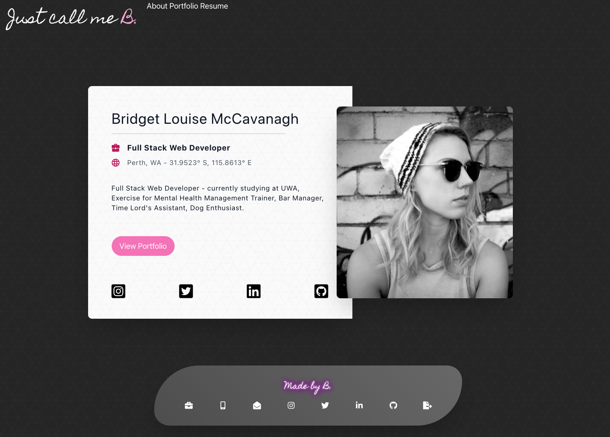
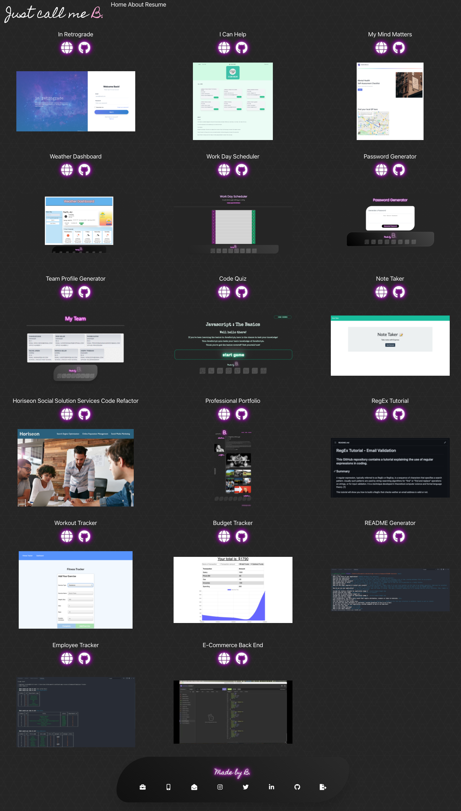
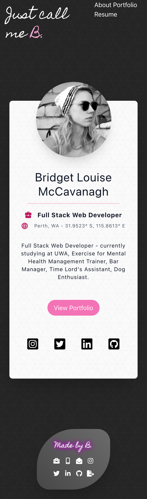

# Bridget McCavanagh - Professional Portfolio

## This GitHub repository contains the code for a professional portfolio website exhibiting a summary of my professional experience, a portfolio of my work and my contact information.

---

### This applications allows for a user to create a portfolio of work on a simple and clean UI using React.

---

## Table of Contents

* [Installation and Usage](#installation-and-usage)
  * [Installation](#installation)
  * [Usage](#usage)
* [Motivation and Research](#motivation-and-research)
* [Development](#development)
  * [Web development technologies](#web-development-technologies)
  * [Graphic Design and Branding](#graphic-design-and-branding)
  * [Challenges](#challenges)
  * [Future Development Opportunities](#future-development-opportunities)
* [License](#license)
* [Contributing](#contributing)
* [Questions](#questions)
* [Repository Link:](#repository-link)
* [Application Screenshots:](#application-screenshots)
* [Walkthrough Video:](#walkthrough-video)

---

## Installation and Usage

### Installation

Fork the repository and then run this command within the repo directory:

```npm install```

In the ```package.json``` file, update the ```"homepage"``` with your personal GitHub pages link.

### Usage

Ensure you are running the terminal from the root path of the directory.

Use ```npm start```to start the application on your local server.

Update the portfolio with your own personal information and portfolio examples.

Use ```npm run deploy``` to build and deploy the page to github pages.

---

## Motivation and Research

The motivation behind this project was to begin to work with React to build an application.

I wanted to develop this website to serve as a homepage or internet presence for my work as a web developer and as a method of showcasing my developing skills with HTML, CSS and React with a particular focus on providing a web standards compliant layout and a focus on accessibility, allowing users with accessibility devices to be able to utilise the website effectively.

I aim to continue to develop this website as a showcase and portfolio for my development work, with the ultimate goal of using it as a showcase for employment or contract opportunities and to provide a single location containing my work, contact details and social media presence.

In developing this website I worked to create a CSS based layout that was optimised for both desktop and mobile based view by utilising the Tailwind CSS framework. I utilised assistance and collaboration with my developer peers to overcome some of the issues I experienced with CSS styling and adapting the website to display on mobile devices in a way that was aesthetically pleasing. I faced particular challenges when designing the layout of my portfolio page. Utilising flex and grid containers provided the most optimal tools to get this webpage to display as I wanted but getting a better understanding of these concepts in order to utilize them certainly required a high level of effort. I also wanted this webpage to be resposive to ensure a positive user experience on varying devices; the use of Tailwind CSS allowed me to do this easily.

In order to make the website stand out from my peers I had a particular focus on aesthetics and layout, with the goal of having a website that was pleasing to the eye, easy to navigate and consistent in its application of style and graphics. The site clearly states my professional goals, allows for a showcase of the work I am developing and allows for contact opportunities.

---

## Development

### Web development technologies

Development of the project was centered around using React in the frontend and Node in the backend.

React is a free and open-source front-end JavaScript library for building user interfaces or UI components.

Node.js is an open-source, cross-platform, back-end JavaScript runtime environment that runs on the V8 engine and executes JavaScript code outside a web browser.

I implemented the use of CRACO, **C**reate **R**eact **A**pp **C**onfiguration **O**verride, an easy and comprehensible configuration layer for create-react-app, in order to utilise Tailwind CSS to style this application.
 
Links to the languages and tools used to build this project are included below:

* HTML5
* Javascript ES6
* CSS3
* Tailwind CSS
    * https://tailwindcss.com/
* Google Fonts :
    * https://fonts.google.com/
* Font Awesome Icons
    * https://fontawesome.com/
* React :
    * https://reactjs.org/
* CRACO :
    * https://github.com/gsoft-inc/craco
* Node.js :
    * https://nodejs.org/
* NPM :
    * https://www.npmjs.com/

### Graphic Design and Branding

Working from a previous portfolio project, and from the brand identity I have formed throughout my applications, I developed the website layout and user interface using React and the use of the TailwindCSS framework. Using the previous project as a starting point I performed heavy customisations by way of using pages and components with React and CSS styling to apply the branding I have developed for my application portfolio while meeting the specifications of the desired functionality for the application.

Customisations included layout and styling by utilising the TailwindCSS framework, customised fonts, icons and background images that are consistent with my other projects. The addition of an on-brand footer with links to contact information, including my Github profile and a download link of my current resume serves as a way to further personalize the application and maintain consistent branding throughout my projects.

### Challenges

While I had the design plan for my portfolio, implementing it to a level that I was satisfied was a challenge that I faced.

I installed Tailwind CSS to serve as a CSS framework to use in my HTML generation as I have become familiar with it's syntax and used it successfully in previous projects. Tailwind CSS allowed for the use of responsive design for my HTML generation, ensuring that it looked correct on desktop, tablets and mobile devices.

Using React to create components for my portfolio posed my greatest challenge. I had to learn how to link my pages together with the use of React Router DOM. While this first presented me with a challenge, I was able to successfully implement these technologies and deploy a functional application.

### Future Development Opportunities

Future development opportunities for the application can be focused on both the back end database and the user interface used to run the application.

The next focus point will be centered around the creation of a "Contact Me" page, where visitors to my portfolio can contact me directly. Utilising a technology such as nodemailer would allow for this to be implemented.

As this was originally a proof of concept application, this was not developed for the first release but would be a focus for a production version of the application.

---

## License

This repository is licensed under the MIT license.

---

## Contributing

No contributions at this time.

---

## Questions

If you have any questions, check out my <a href="https://www.github.com/blmccavanagh">GitHub</a> or email me <a href="mailto:blmccavanagh@gmail.com">here</a>.

---

<div align="center">

**Thank you for visiting.**

</div>

---

### Repository Link:

* https://github.com/blmccavanagh/React-Portfolio

---

### Deployed Application Link:

* https://blmccavanagh.github.io/Professional-Portfolio/

---

<div align="center">

### Application Screenshots:

*Homepage Desktop Screen Capture*



---

*Portfolio Desktop Screen Capture*



---

*Homepage Mobile View Screen Capture*



---

*Portfolio Mobile View Screen Capture*


---